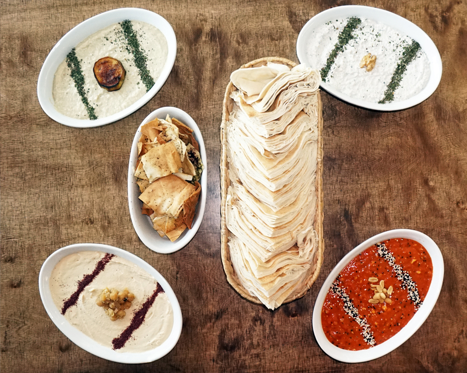

### Hinweis

Es wird ausschließlich veganes/vegetarisches Essen geben.
Wer das keinen halben Tag „aushält“, holt sich lieber vorher noch eine Bocki an der Tanke ;P

Menschen mit Allergien oder starken Unverträglichkeiten melden sich bitte bei uns. Beim Buffet werden Allergene entsprechend ausgewiesen sein.

Bringt gerne Transport-Boxen mit, falls Essen übrig bleibt, das ihr mitnehmen möchtet.

---

## Futter-Plan

### 16:00 – 18:00 Uhr: Kuchen-Mitbring-Buffet

Eure Mithilfe ist hier sehr gefragt. Wer Lust hat zu backen und nicht erst um 18:00 Uhr anreist, kann uns alle gern mit seinen/ihren Backkünsten verwöhnen.

Bitte sprecht euch kurz mit uns ab, damit nicht fünfmal die Schoko-Sahne-Torte auf dem Tisch steht.

Wenn wir uns Kuchensorten wünschen dürften, dann gern:

* etwas mit Früchten
* etwas mit Streuseln
* etwas mit Pudding oder Quark

Bitte verzichtet auf übertrieben aufwendige „Hochzeitstorten“.

---

### 19:00 – 20:30 Uhr: veganes/vegetarisches Hochzeits-Buffet

Lasst euch überraschen von feiner syrischer Küche vom Maza Pita-Team aus Leipzig.  
Es wir jede Menge Vorspeisen, Salate, Fingerfood und andere Leckereien geben.
      
Für das abschließende Dessert bräuchten wir eure Unterstützung:   
Wer Lust und Zeit hat, kann sehr gern Tiramisu, Mousse au Chocolat, Fruchtspeisen, Pudding, oder andere Naschereien zubereiten und mitbringen.   
Bitte gebt uns hierzu kurz Bescheid, damit wir alles entsprechend koordinieren können.  

 
  
 
  
 
---

### ab 23 Uhr: Spätstück

Mit Kuchen, Obst, Käse und verschiedenen Brotsorten

---

### Samstag 9-11 Uhr: 

Frühstück für alle Übernachtungsgäste

---

